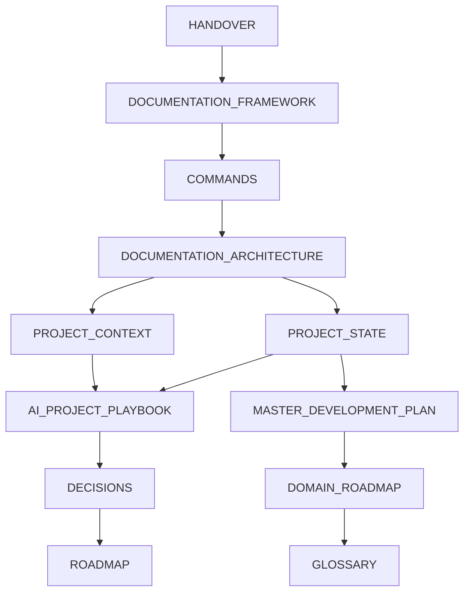

# Family Memory AI
## Documentation Architecture

This document defines the documentation ecosystem of Family Memory AI.

Each document has a single responsibility.

Duplicated information across documents should be avoided.

Whenever possible, documents should reference each other instead of repeating content.

---

## Documentation Principles

### Single Source of Truth
Each information domain must have one authoritative document owner.
All other documents should reference that source instead of copying it.

### Separation of Responsibilities
Every document must have a clear role and scope.
A document should not mix multiple responsibilities that belong elsewhere.

### Minimal Duplication
Repeated content increases inconsistency risk.
Use links and references whenever the same concept is already documented.

### Predictable Navigation
Readers should know where to find information quickly.
The reading order and ownership model must remain stable over time.

### AI-Friendly Structure
Documentation should be explicit, structured, and machine-readable.
AI assistants must be able to initialize context without hidden assumptions.

### Documentation is Production Code
Documentation is treated as a first-class project artifact.
Implementation work is incomplete until required documentation updates are completed.

### Contextual Workspace Help Is Product Documentation
Contextual workspace Help is part of product functionality, not optional supporting text.
User-facing behavior changes require synchronized updates to workspace Help definitions.

### Human Readability
Documentation must remain clear for humans, not only for automation.
Use concise language, clear sections, and explicit boundaries.

### Incremental Evolution
Documentation architecture should evolve in small controlled steps.
When responsibilities change, update ownership and cross-references immediately.

### Documentation Minimalism
Prefer extending existing documents over creating new files.
New documents should be created only when they provide unique responsibility, clear separation of concerns, and measurable long-term value.
Avoid document proliferation that weakens ownership clarity.

---

## Documentation Reading Order

Official reading order for every new ChatGPT conversation:

1. docs/bootstrap/HANDOVER.md
2. docs/bootstrap/DOCUMENTATION_FRAMEWORK.md
3. docs/bootstrap/AI_BOOTSTRAP.md
4. docs/bootstrap/COMMANDS.md
5. docs/development/DOCUMENTATION_ARCHITECTURE.md
6. docs/project/PROJECT_CONTEXT.md
7. docs/project/PROJECT_STATE.md
8. docs/development/AI_PROJECT_PLAYBOOK.md
9. docs/development/DECISIONS.md
10. docs/project/MASTER_DEVELOPMENT_PLAN.md
11. docs/project/DOMAIN_ROADMAP.md
12. docs/project/ROADMAP.md (historical/transitional, if present)
13. docs/project/GLOSSARY.md
14. Additional referenced mandatory documents

Why this order exists:
- docs/bootstrap/HANDOVER.md defines initialization entry and mandatory startup behavior.
- docs/bootstrap/DOCUMENTATION_FRAMEWORK.md defines framework versioning, compatibility, and command execution constraints.
- docs/bootstrap/AI_BOOTSTRAP.md defines mandatory AI operating behavior.
- docs/bootstrap/COMMANDS.md defines command execution semantics.
- docs/development/DOCUMENTATION_ARCHITECTURE.md defines how the documentation system itself is organized.
- docs/project/PROJECT_CONTEXT.md establishes product and business context.
- docs/project/PROJECT_STATE.md establishes current implementation reality.
- docs/development/AI_PROJECT_PLAYBOOK.md defines execution workflow and collaboration rules.
- docs/development/DECISIONS.md provides approved architectural decisions.
- docs/project/MASTER_DEVELOPMENT_PLAN.md provides the highest-level future product direction.
- docs/project/DOMAIN_ROADMAP.md provides the official future direction after current-state context is known.
- docs/project/ROADMAP.md provides historical and transitional planning context.

---

## Documentation Responsibilities

| Document | Purpose | Contains | Does NOT contain |
| --- | --- | --- | --- |
| docs/bootstrap/HANDOVER.md | Entry point for every new conversation | Initialization workflow | Command definitions |
| docs/bootstrap/COMMANDS.md | Defines project commands | Command behaviors | Project state |
| docs/development/DOCUMENTATION_ARCHITECTURE.md | Defines documentation architecture | Document responsibilities, relationships, reading order | Implementation status details |
| docs/project/PROJECT_CONTEXT.md | Business and project context | Collaboration context, business scope, project framing | Sprint-by-sprint implementation status |
| docs/product/PRODUCT_VISION.md | Canonical product vision | Mission, product philosophy, major objectives | Current sprint ownership |
| docs/project/PROJECT_STATE.md | Current implementation status | Completed work, current sprint, pending work | Full command behavior definitions |
| docs/project/MASTER_DEVELOPMENT_PLAN.md | Highest-level project planning | Product mission, domains, principles, planning rule | Implementation status details |
| docs/project/DOMAIN_ROADMAP.md | Official future roadmap | Domains, milestones, capability structure | Historical implementation log |
| docs/development/AI_PROJECT_PLAYBOOK.md | Development methodology | Development rules, coding workflow, documentation workflow, AI collaboration rules | Project state ownership |
| docs/development/DECISIONS.md | Architectural Decision Record (ADR) ledger | Historical approved project decisions | Day-to-day task execution details |
| docs/project/ROADMAP.md | Future direction | Future releases, planned sprints | Current implementation status details |

## Directory Organization

The documentation repository is organized by responsibility domain:

- `docs/bootstrap/`: AI/session initialization and command operation references.
- `docs/project/`: Project context, operational state, planning, and terminology.
- `docs/product/`: Canonical product mission, scoring philosophy, and long-term behavior definitions.
- `docs/development/`: Development methodology, decision ledger, and documentation governance.
- `docs/architecture/`: System architecture and technical structure references.
- `docs/testing/`: Test strategy, cases, and reporting artifacts.
- `docs/releases/`: Changelog and release/migration communication.
- `docs/archive/`: Legacy or superseded documents preserved for traceability.

---

## Documentation Relationships

The documentation system is hierarchical and dependency-aware.

- HANDOVER starts initialization.
- DOCUMENTATION_FRAMEWORK defines framework constraints and compatibility.
- COMMANDS governs operational behavior.
- DOCUMENTATION_ARCHITECTURE defines documentation structure.
- PROJECT_CONTEXT and PROJECT_STATE provide strategic and operational context.
- MASTER_DEVELOPMENT_PLAN defines the highest-level product planning direction.
- DOMAIN_ROADMAP organizes future work by domain and milestone.
- AI_PROJECT_PLAYBOOK defines execution discipline.
- DECISIONS constrains architecture via approved choices.
- ROADMAP preserves historical and transitional planning context.

---

## Documentation Ownership

### Current Sprint
Owner:
docs/project/PROJECT_STATE.md

### Architecture Decisions
Owner:
docs/development/DECISIONS.md

### Project Commands
Owner:
docs/bootstrap/COMMANDS.md

### Development Workflow
Owner:
docs/development/AI_PROJECT_PLAYBOOK.md

### Initialization Workflow
Owner:
docs/bootstrap/HANDOVER.md

### Documentation Architecture Rules
Owner:
docs/development/DOCUMENTATION_ARCHITECTURE.md

### Product Context and Vision
Owner:
docs/project/PROJECT_CONTEXT.md and docs/product/PRODUCT_VISION.md

### Future Planning
Owner:
docs/project/MASTER_DEVELOPMENT_PLAN.md and docs/project/DOMAIN_ROADMAP.md

---

## Updating Documentation

Recommended update sequence after implementation changes:

Implementation changes

↓

docs/project/PROJECT_STATE.md

↓

If architecture changed

↓

docs/development/DECISIONS.md

↓

If workflow changed

↓

docs/bootstrap/COMMANDS.md

↓

If document responsibilities changed

↓

docs/development/DOCUMENTATION_ARCHITECTURE.md

Additional guidance:
- Update only documents impacted by the change.
- Preserve single source ownership.
- Add references instead of duplicating existing content.
- Prefer extending existing documentation before creating a new document.
- Introduce new documents only when ownership and long-term value are explicit.

---

## AI Guidelines

AI assistants should:

- Read documentation in the official order.
- Never invent project rules.
- Never duplicate documentation without need.
- Respect document ownership boundaries.
- Always update the correct document based on ownership.
- Report missing documentation and unresolved references.
- Report missing or outdated contextual workspace Help as a documentation issue.

DOCSYNC and DOCVERIFY Workspace Help rule:

- DOCSYNC must update workspace Help content whenever functionality changes user experience or user decision flow.
- DOCVERIFY must validate that workspace Help content matches implemented behavior.

---

## Definition of Done

This document is the official reference describing the documentation ecosystem of Family Memory AI.

Future documentation changes must remain consistent with this architecture.

Additional permanent requirement:

"A user-facing feature is not considered complete until its contextual Workspace Help has been updated and accurately reflects the current functionality."
